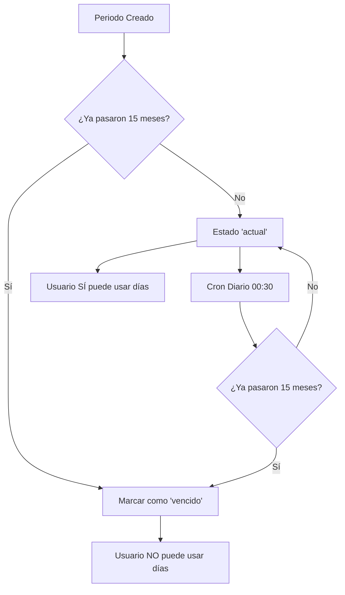

# Sistema de Vencimiento de Periodos de Vacaciones

## 📋 Resumen

El sistema de vacaciones ahora incluye **vencimiento automático** de periodos después de **15 meses** desde el fin del periodo.

---

## 🕒 Política de Vencimiento

### **Regla Principal:**
Los periodos de vacaciones **vencen automáticamente 15 meses después** de su fecha de finalización (`date_end`).

### **Cálculo de Vencimiento:**
```
Fecha de Vencimiento = date_end + 15 meses
```

### **Ejemplo:**
- **Periodo:** 01 Enero 2024 - 31 Diciembre 2024
- **Fin del periodo:** 31 Diciembre 2024
- **Fecha de vencimiento:** 31 Marzo 2026 (15 meses después)
- **Estado:** Si hoy es después del 31 Marzo 2026 → **"vencido"**

---

## 🔄 Funcionamiento Automático

### **1. Al Calcular Vacaciones**
Cuando se ejecuta `calculateVacationsForUser()`:

✅ **Periodos Existentes:**
- Verifica automáticamente si deben vencer
- Marca como "vencido" si ya pasaron 15 meses
- Registra en logs la acción

✅ **Periodos Nuevos:**
- Calcula fecha de vencimiento al crear
- Si ya está vencido al momento de creación, lo marca directamente

### **2. Verificación Diaria Automática**
**Comando:** `vacations:check-expired`
**Horario:** Todos los días a las 00:30 AM
**Zona horaria:** America/Mexico_City

**Acciones:**
1. Revisa todos los periodos activos (no históricos, no vencidos)
2. Calcula fecha de vencimiento para cada uno
3. Marca como "vencido" los que ya pasaron 15 meses
4. Registra en logs cada vencimiento

---

## 🎯 Estados de Periodos

| Estado | Descripción | Puede Usar Días |
|--------|-------------|-----------------|
| **actual** | Periodo vigente, disponible para usar | ✅ Sí |
| **vencido** | Periodo expirado (>15 meses desde fin) | ❌ No |
| **histórico** (`is_historical=true`) | Periodos del esquema antiguo (pre-2023) | ❌ No |

---

## 💻 Comandos Disponibles

### **1. Verificar Periodos Vencidos**
```bash
# Ejecutar verificación y marcar vencidos
php artisan vacations:check-expired

# Solo ver estadísticas sin hacer cambios
php artisan vacations:check-expired --stats

# Modo dry-run (simular sin cambios)
php artisan vacations:check-expired --dry-run
```

**Salida del Comando:**
```
🔍 Iniciando verificación de periodos vencidos...

✅ Verificación completada:
   📋 Periodos verificados: 150
   ⏰ Periodos marcados como vencidos: 12

📊 Estado actual de periodos:
┌─────────────────────────────────┬──────────┐
│ Estado                          │ Cantidad │
├─────────────────────────────────┼──────────┤
│ ✅ Periodos Activos             │ 138      │
│ ⏰ Periodos Vencidos            │ 25       │
│ 📜 Periodos Históricos          │ 87       │
│ ⚠️ Próximos a vencer (30 días) │ 5        │
└─────────────────────────────────┴──────────┘

⚠️ Hay 5 periodo(s) que vencerán en los próximos 30 días
```

---

## 🔧 Integración con Código Existente

### **1. Método `getAvailableDaysForUser()`**
**Cambio:** Ahora **excluye automáticamente** periodos vencidos

```php
// ❌ ANTES: Contaba todos los periodos no históricos
$vacations = VacationsAvailable::where('users_id', $user->id)
    ->where('is_historical', false)
    ->get();

// ✅ AHORA: Excluye vencidos también
$vacations = VacationsAvailable::where('users_id', $user->id)
    ->where('is_historical', false)
    ->where('status', '!=', 'vencido')  // 👈 Nueva validación
    ->get();
```

**Impacto:**
- ✅ Los usuarios **NO** pueden solicitar vacaciones de periodos vencidos
- ✅ El reporte de días disponibles **NO** cuenta periodos vencidos
- ✅ Solo muestra días realmente utilizables

### **2. Nueva Constante**
```php
const EXPIRATION_MONTHS = 15; // Meses hasta vencimiento
```

### **3. Nuevo Método en Servicio**
```php
// Verificar vencimientos para todos los usuarios
$results = $vacationService->checkExpiredPeriodsForAllUsers();

// Retorna:
[
    'checked' => 150,    // Total periodos verificados
    'expired' => 12,     // Periodos marcados como vencidos
    'errors' => []       // Errores encontrados
]
```

### **4. Método Protegido**
```php
// Verificar y marcar un periodo específico
$vacationService->checkAndMarkExpired($vacation, $today);
```

---

## 📊 Impacto en Reportes y Vistas

### **Vista: Reporte de Vacaciones**
Los periodos vencidos se muestran pero:
- ✅ Aparecen con badge **"Vencido"** en rojo
- ✅ **NO** se suman a días disponibles
- ✅ Se diferencian visualmente

### **Vista: Solicitud de Vacaciones**
- ✅ Usuario **NO** puede usar días de periodos vencidos
- ✅ Solo se muestran periodos con `status = 'actual'`

### **Vista: Aprobación RH**
- ✅ RH puede ver periodos vencidos para auditoría
- ✅ Alertas visuales de días no utilizados

---

## 🔐 Validaciones Implementadas

### **1. Al Crear Periodo**
```php
$expirationDate = $dateEnd->copy()->addMonths(15);
$status = $today->gt($expirationDate) ? 'vencido' : 'actual';
```

### **2. Al Actualizar Periodo Existente**
```php
if ($existingRecord) {
    $this->checkAndMarkExpired($existingRecord, $today);
    // ... resto del código
}
```

### **3. Al Consultar Días Disponibles**
```php
->where('status', '!=', 'vencido')
```

---

## 📅 Programación Automática

### **Cron Configurado:**
```php
$schedule->command('vacations:check-expired')
         ->dailyAt('00:30')
         ->timezone('America/Mexico_City')
         ->withoutOverlapping()
         ->runInBackground();
```

### **Orden de Ejecución Diaria:**
1. **00:01 AM** - Actualizar acumulación diaria (`vacations:update-accrual`)
2. **00:30 AM** - Verificar periodos vencidos (`vacations:check-expired`) 👈 **NUEVO**
3. **09:00 AM** - Procesar auto-aprobaciones (`vacations:auto-approve`)

---

## 📝 Logs Generados

### **Formato de Log:**
```php
Log::info("Periodo de vacaciones vencido automáticamente", [
    'vacation_id' => 123,
    'user_id' => 45,
    'period' => 2,
    'date_end' => '2024-12-31',
    'expiration_date' => '2026-03-31',
    'days_remaining' => 8.5
]);
```

### **Ubicación:**
- `storage/logs/laravel.log`
- Búsqueda: "Periodo vencido automáticamente"

---

## ⚠️ Consideraciones Importantes

### **1. Periodos Históricos**
- ❌ **NO** se marcan como vencidos (ya están marcados como históricos)
- ✅ Se omiten automáticamente en verificaciones

### **2. Días No Utilizados**
- ⚠️ Si un periodo vence con días restantes, el empleado **PIERDE** esos días
- 💡 Recomendación: Notificar a usuarios 30 días antes del vencimiento

### **3. Idempotencia**
- ✅ Es seguro ejecutar `check-expired` múltiples veces
- ✅ Solo marca como vencido una vez
- ✅ Registra log solo en el primer cambio

### **4. Performance**
- ✅ Procesa en chunks de 100 registros
- ✅ No bloquea otras operaciones (`runInBackground`)
- ✅ Previene ejecuciones simultáneas (`withoutOverlapping`)

---

## 🧪 Testing

### **Verificar Manualmente:**
```bash
# Ver estadísticas actuales
php artisan vacations:check-expired --stats

# Simular ejecución
php artisan vacations:check-expired --dry-run

# Ejecutar realmente
php artisan vacations:check-expired
```

### **Crear Periodo de Prueba Vencido:**
```php
$vacation = VacationsAvailable::create([
    'users_id' => 1,
    'period' => 1,
    'days_availables' => 12,
    'dv' => 0,
    'days_enjoyed' => 0,
    'date_start' => Carbon::now()->subMonths(27),  // Hace 27 meses
    'date_end' => Carbon::now()->subMonths(15),    // Hace 15 meses
    'cutoff_date' => Carbon::now()->subMonths(15)->endOfYear(),
    'is_historical' => false,
    'status' => 'actual'  // Debe cambiar a 'vencido' al ejecutar check
]);
```

---

## 🔄 Flujo Completo



---

## 📞 Soporte

- **Comando principal:** `php artisan vacations:check-expired`
- **Logs:** `storage/logs/laravel.log`
- **Constante configurable:** `VacationCalculatorService::EXPIRATION_MONTHS`

---

## 🎓 Resumen Ejecutivo

✅ **Periodos vencen automáticamente después de 15 meses**
✅ **Verificación diaria a las 00:30 AM**
✅ **Los días vencidos NO se pueden usar**
✅ **Sistema completamente automatizado**
✅ **Logs de auditoría completos**
✅ **Comando manual disponible**
